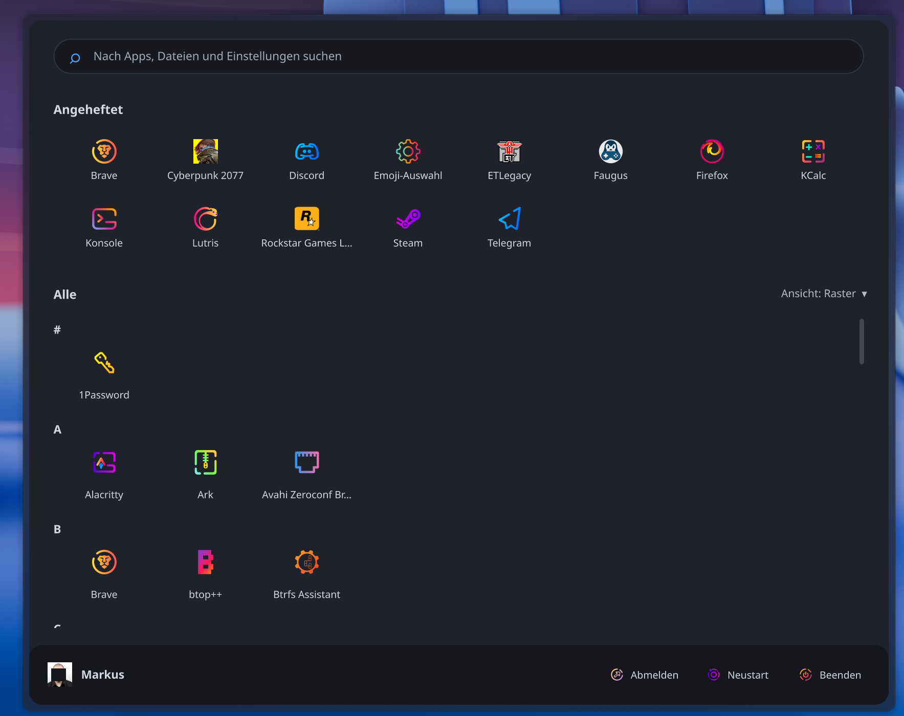
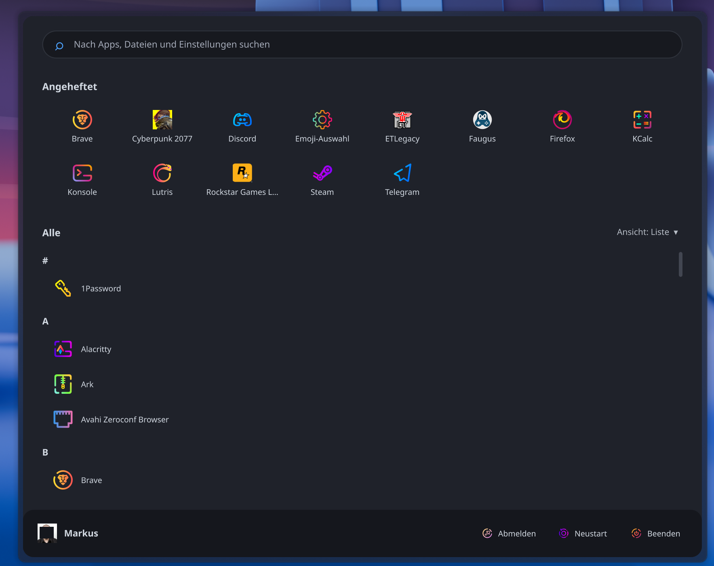
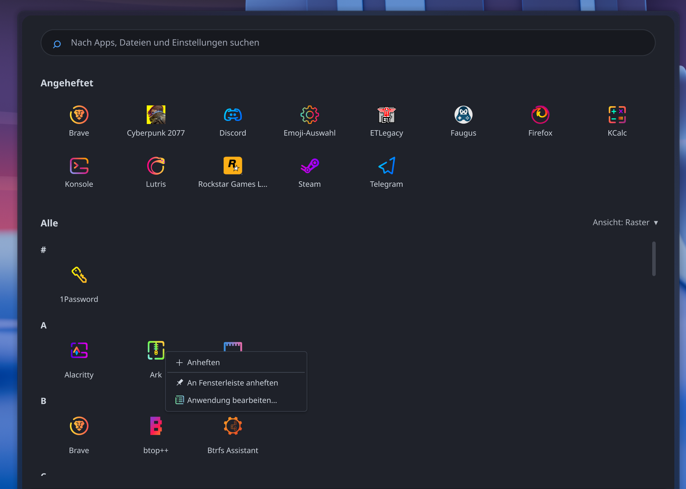
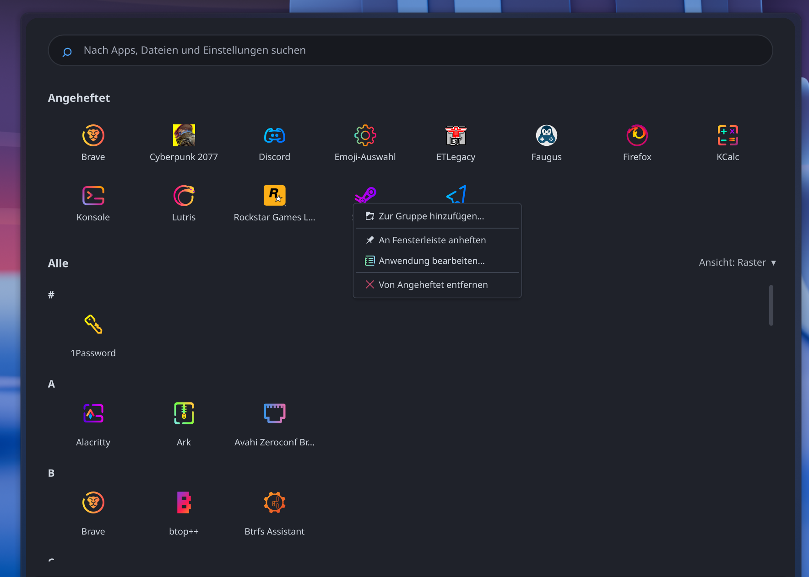
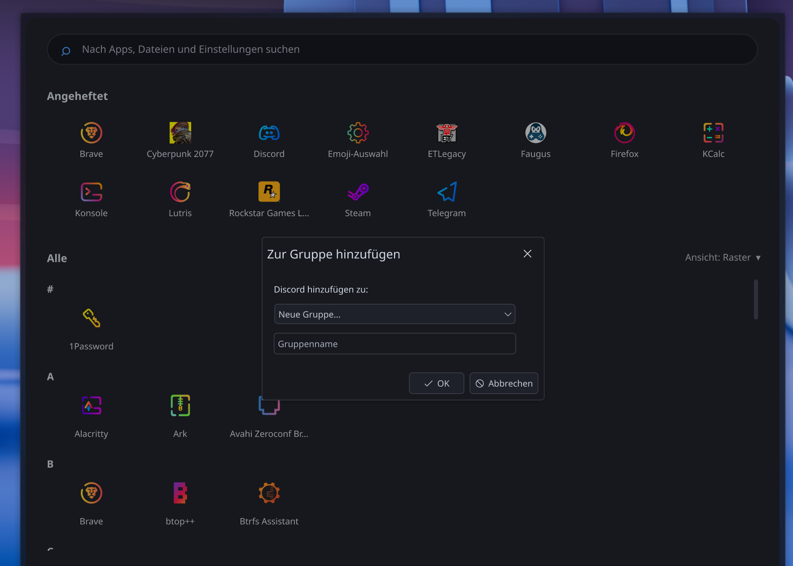
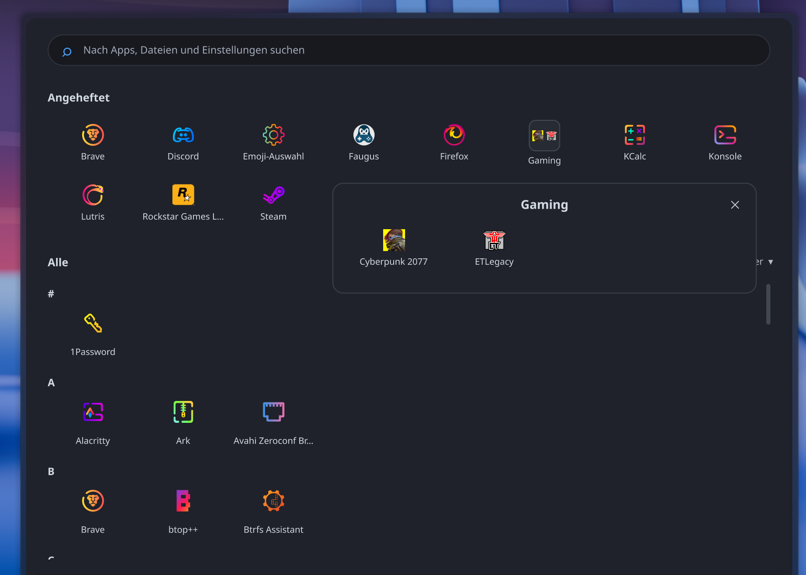
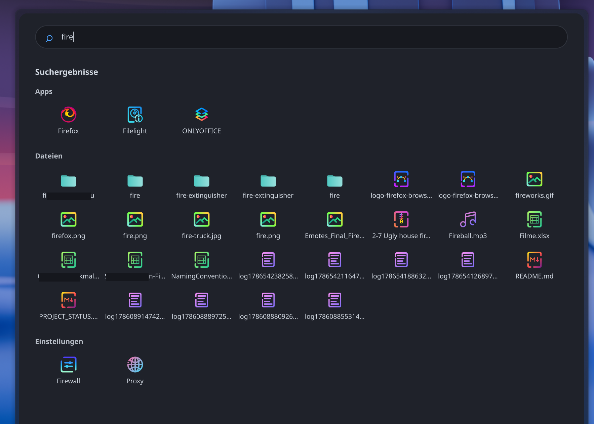
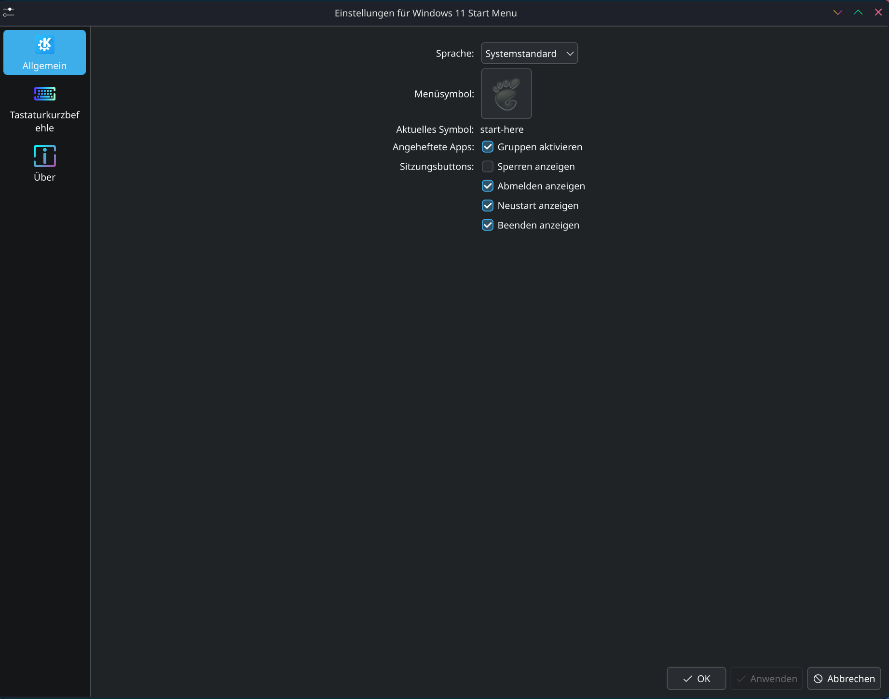

# 🪟 Win11-Style Application Launcher for KDE Plasma

A modern, Windows 11 inspired application launcher menu for KDE Plasma 6.
Clean dark design, fast search and full KDE integration – built with pure QML.

### 📸 Screenshots

<p align="center">
  
  
</p>

<p align="center">
  
  
</p>

<p align="center">
  
  
</p>

<p align="center">
  
  
</p>

### ✨ Features

- 📌 **Pinned apps** – pin/unpin applications via right-click context menu
- 🗂️ **Pinned groups** – organize pinned apps into optional named groups with up to 12 apps per group
- 🧩 **KDE context actions** – pin applications to the Task Manager or edit their application entry from Pinned, All Applications and application search results
- 🔤 **All applications** – alphabetically grouped applications
- 📐 **Grid / List view** – switch between a compact grid and a clean list layout
- 🔍 **Integrated search** – applications, files (via Baloo) and system settings
- ⌨️ **Quick search** – press `Ctrl+F` to instantly focus the search field
- 🎨 **Custom menu icon** – choose the launcher icon directly in General settings
- 📏 **Flexible menu size** – configure menu width and height to fit your screen and preferred layout
- 🖼️ **Configurable app icons** – adjust application icon size from compact to large
- 🌍 **Multi-language support** – English, German, French, Italian and Dutch
- ⚙️ **Language selection** – follow the system language or choose a language manually
- 🇬🇧 **English fallback** – missing translations fall back to English
- 👤 **User info** – avatar and full name of the current user
- 🔐 **Session actions** – Lock Screen, Log Out, Restart and Shut Down
- 👁️ **Session button visibility** – show or hide each session button individually
- 🔒 **Stable popup layout** – additional pinned apps do not unexpectedly resize the launcher

### ⚙️ Customization

Open:

**Configure Windows 11 Start Menu → General**

Available options include:

- **Language** – use the system language or choose a supported language manually
- **Menu icon** – choose a different KDE/system icon for the launcher
- **Icon size** – choose an application icon size from 24 px to 48 px (default: 36 px)
- **Menu height** – choose a launcher height from 600 px to 1200 px (default: 800 px)
- **Menu width** – choose a launcher width from 800 px to 1600 px (default: 1000 px)
- **Pinned apps → Enable groups** – enable or disable pinned application groups
- **Session buttons** – individually show or hide Lock Screen, Log Out, Restart and Shut Down

Disabling pinned groups does **not** delete existing group assignments. Re-enabling the option restores them.

Wider menu widths automatically provide additional pinned-app columns while keeping the familiar minimum of 8 columns.

### 🗂️ Pinned application groups

Pinned groups make it possible to organize related applications without changing the normal KDE favorites list.

To create or use a group:

1. Right-click a regular pinned application.
2. Choose **Add to group…**.
3. Select an existing group or create a new one.

Group behavior:

- groups and regular pinned applications stay alphabetically sorted
- applications inside a group stay alphabetically sorted
- a group shows a compact preview of the applications it contains
- clicking a group opens its applications in a compact popup
- each group can contain up to **12 applications**
- the popup displays up to **4 columns × 3 rows** without scrolling
- right-click a group to rename or dissolve it
- right-click an application inside a group to remove it from the group

Application entries in **Pinned**, **All Applications** and **application search results** expose selected native KDE actions in their context menu:

- **Pin to Task Manager**
- **Edit Application**

Pinned applications and application search results additionally support pin/unpin behavior for the launcher itself.

### 🌍 Languages

The launcher follows the system language by default.

You can override it in:

**Configure Windows 11 Start Menu → General → Language**

Supported languages:

- Deutsch
- English
- Français
- Italiano
- Nederlands

If a translation is missing, the launcher falls back to English.

### 📦 Requirements

- KDE Plasma 6 (Qt 6 / QML)
- Optional: **Baloo** file indexer for file search

### 🛠️ Installation

**Via KDE Store (recommended):**

1. Right-click your desktop → *Add Widgets* → *Get New Widgets*
2. Search for this plasmoid and click *Install*
3. Right-click your panel → *Add Widgets* → drag the launcher onto the panel

**Manual:**

1. Copy the folder to:

   `~/.local/share/plasma/plasmoids/tv.wooti.win11menu`

2. Restart Plasma or log out and back in.

### 📁 Setting up file search (Baloo)

The file search uses KDE's native Baloo index.
Only **indexed folders** are searched. If your files are not found, enable
indexing and add the folders you want:

1. Open **System Settings**
2. Go to *Search → File Search*
3. Enable indexing and add the folders you want (Documents, Downloads, …)
4. Click *Apply*

**Or via terminal:**

```bash
balooctl6 enable
balooctl6 check
balooctl6 status
```

> 💡 **Note:** If Baloo is disabled or folders are excluded in your setup,
> file search will return no results. Application and system settings search
> work regardless.

---

## 📄 License

This project is licensed under **GPL-2.0-or-later**. See [`LICENSE`](LICENSE) for the full license text.

---

Made with 🦊 and lots of QML
